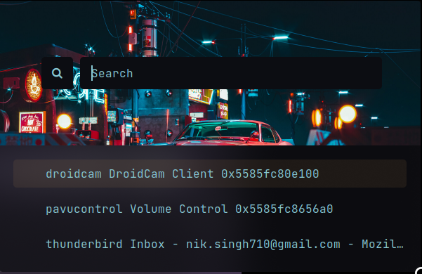
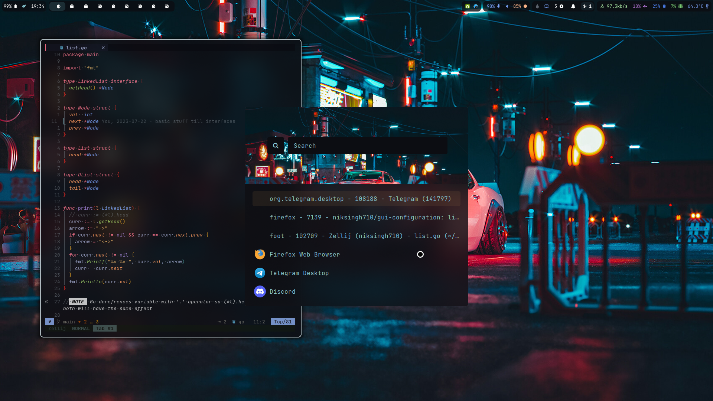
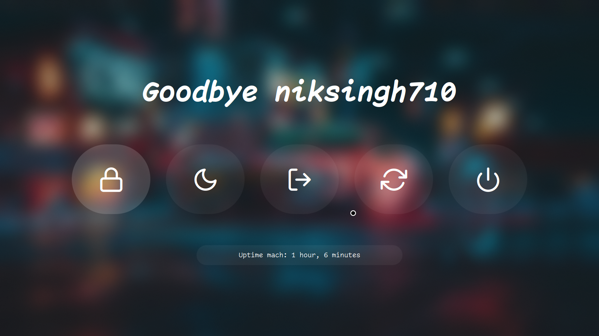
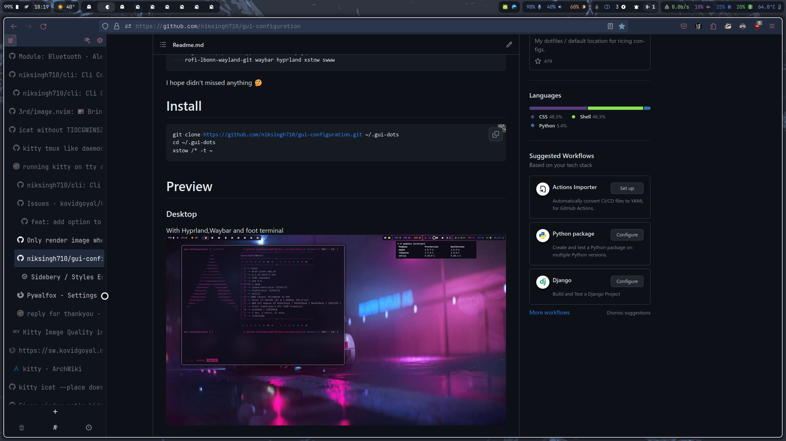

# GUI Config

This is my Arch Linux GUI Config and Scripts.
I use [rofi](https://github.com/lbonn/rofi) as my application launcher, and [Hyprland](https://github.com/hyprwm/hyprland) as my window manager.

# Installation

```
yay -S --needed \
    rofimoji rofi-calc rofi-bluetooth-git android-file-transfer-linux-git \
    nemo wpgtk zathura zathura-pdf-mupdf \
    brightnessctl pipewire pipewire-pulse wireplumber \
    networkmanager networkmanager-dmenu-git \
    xdg-desktop-portal-hyprland libnoitfy jq \
    rofi-lbonn-wayland-git waybar hyprland xstow swww
```

I hope didn't missed anything 🤔

# Install

```
git clone https://github.com/niksingh710/gui-configuration.git ~/.gui-dots
cd ~/.gui-dots
xstow */ -t ~
```

# Preview

### Desktop

With Hyprland,Waybar and foot terminal


### Rofi

I use rofi with waybar to interact with my waybar custom modules Like (cpu freq and notification)



### Rofi on Faded Color




### Firefox theme

I use firefox with tree like tab structure and firenvim and much more plugins



Make sure to add chrome folder to firefox from the extra/chrome
Make sure to have beta sideberry with it's css also in extra/chrome/sideberry.css add this in extension settings

# Note

xstow links to the parent dir (make sure to read help)
keep in mind to give the args `-t ~` no matter where you are cloning
